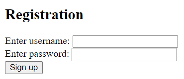
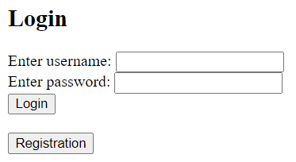
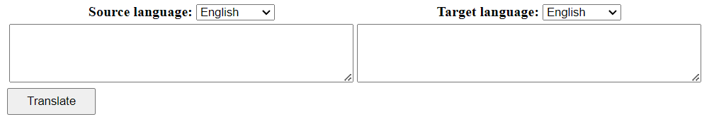
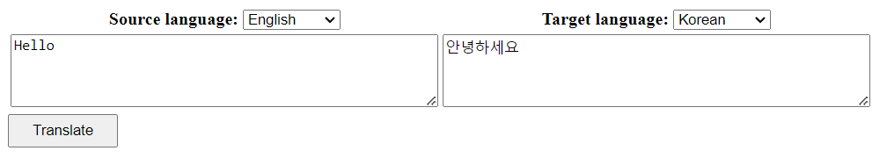

# Translator
* Translator application using Systran Translation API.
* Created for learning purposes. 

## Requirements
* JDK 17
* Apache Maven 3.6.3
* PostgreSQL 10+

## Tech stack
* Spring 
  * Boot 3
  * Data (JPA / Hibernate)
  * Security 6
* Databases
  * PostgreSQL
* Thymeleaf
* Hibernate Validator
* Systran Translation API
  
## Installation
Clone repository form GitHub.
```shell
git clone https://github.com/1aazy/TranslatorApp.git
```
Register at "https://www.systransoft.com" and get API key.
<br/>
Rename "application.properties.origin" to "application.properties" 
and fill out this file with your data source settings and Systran API key.
```shell
spring.datasource.url=
spring.datasource.username=
spring.datasource.password=

systran.translation.key=
```
You can create a table using "database.sql" file.
```shell
src/resources/static/database.sql
```

## Functionality
To start using the app you need to register:
```shell
http://localhost:8080/auth/registration
```
* Registration page:


After registration, log in.
* Login page:


Now you can see user interface.<br/>


Type text in the left input field, select source and target languages and click "Translate" button



